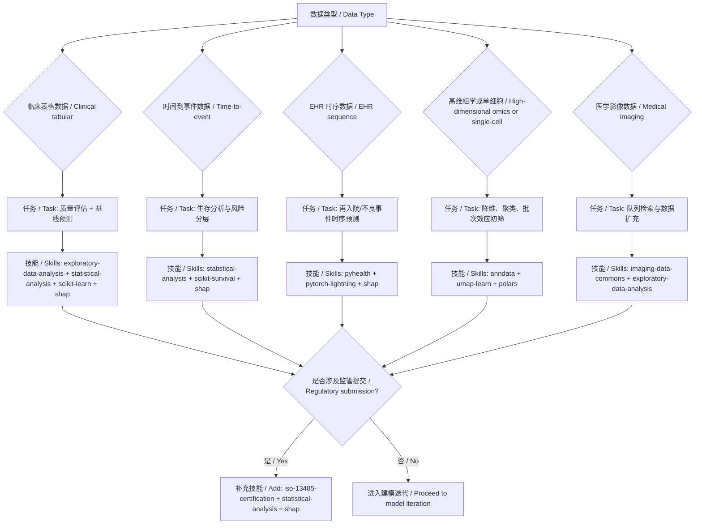

# CodeBuddy 项目级技能说明 / Project Skills Guide

本目录用于存放当前项目的 CodeBuddy 技能。  
This directory stores project-level CodeBuddy skills for this project.

## 最小可用技能集（MVS）/ Minimum Viable Skill Set (MVS)

> 目标：用最少技能覆盖临床数据分析、建模、生存分析、可解释性与合规。  
> Goal: Cover clinical data analysis, modeling, survival analysis, explainability, and compliance with the smallest practical set.

### MVS 单表版 / MVS in One Table

> 单表中英合并，统一“核心必备/增强能力”视觉风格。  
> Core and extended capabilities are merged into one bilingual table for consistent layout.

| # | 分组 / Tier | 技能 / Skill | 用途 / Purpose |
|---|---|---|---|
| 1 | 核心必备<br/>Core | `exploratory-data-analysis` | 自动化 EDA 与数据质量巡检<br/>Automated EDA and data quality inspection |
| 2 | 核心必备<br/>Core | `statistical-analysis` | 假设检验、统计推断与结果报告<br/>Hypothesis testing, statistical inference, and reporting |
| 3 | 核心必备<br/>Core | `scikit-learn` | 临床表格数据建模与特征工程主力<br/>Core library for clinical tabular modeling and feature engineering |
| 4 | 核心必备<br/>Core | `scikit-survival` | 生存分析（Cox、RSF、时间到事件）<br/>Survival analysis (Cox, RSF, time-to-event) |
| 5 | 核心必备<br/>Core | `shap` | 模型可解释性（特征贡献、个体解释）<br/>Model explainability (global/local feature attribution) |
| 6 | 核心必备<br/>Core | `iso-13485-certification` | 医疗器械软件/AI 合规文档与流程参考<br/>Regulatory documentation/process support for medical device AI |
| 7 | 增强能力<br/>Extended | `polars` | 高性能数据处理（大表加速）<br/>High-performance dataframe processing for large datasets |
| 8 | 增强能力<br/>Extended | `anndata` + `umap-learn` | 高维组学/单细胞数据存储与降维<br/>Storage and dimensionality reduction for high-dimensional omics/single-cell data |
| 9 | 增强能力<br/>Extended | `pyhealth` | EHR/临床时序深度学习建模<br/>Deep learning for EHR and clinical sequential data |
| 10 | 增强能力<br/>Extended | `pytorch-lightning` + `transformers` | 多模态/大模型训练与工程化训练循环<br/>Multi-modal/LLM training and production-grade training loops |
| 11 | 增强能力<br/>Extended | `imaging-data-commons` | 临床影像数据检索与数据源扩展<br/>Clinical imaging data access and dataset expansion |


## 推荐工作流 / Recommended Workflow

1) EDA → 2) 统计检验 → 3) 基线模型（`scikit-learn`）→ 4) 生存模型（`scikit-survival`）→ 5) 解释性（`shap`）→ 6) 合规文档（`iso-13485-certification`）  
1) EDA → 2) Statistical testing → 3) Baseline model (`scikit-learn`) → 4) Survival model (`scikit-survival`) → 5) Explainability (`shap`) → 6) Compliance docs (`iso-13485-certification`)

## 快速使用示例 / Quick Prompt Example

```text
请使用 exploratory-data-analysis + statistical-analysis 对我的临床数据做质量评估和显著性检验；
然后用 scikit-learn 建立基线模型、用 scikit-survival 做生存分析，最后用 shap 输出可解释性结论。

Use exploratory-data-analysis + statistical-analysis to run data quality checks and significance tests on my clinical dataset;
then train a baseline model with scikit-learn, run survival analysis with scikit-survival,
and finally produce explainability findings with shap.
```

## 已安装位置 / Installed Location

- `E:\Cursor Project\K-Dense-AI\.codebuddy\skills\`

## 按任务场景选择技能（速查表）/ Skill Selection by Task Scenario (Quick Reference)

> 单表中英合并，减少重复，提升可读性。  
> Bilingual in one table for cleaner visual layout.

| # | 场景 / Scenario | 推荐技能 / Recommended Skills | 交付物 / Deliverables |
|---|---|---|---|
| 1 | 临床表格数据快速建模<br/>Fast clinical tabular modeling | `exploratory-data-analysis` + `statistical-analysis` + `scikit-learn` + `shap` | 数据质量报告、基线模型、关键特征解释<br/>Data quality report, baseline model, feature-level explanations |
| 2 | 生存分析（预后/复发/死亡风险）<br/>Survival analysis (prognosis/relapse/mortality) | `statistical-analysis` + `scikit-survival` + `shap` | C-index/Brier、风险分层、时间到事件解释<br/>C-index/Brier, risk stratification, time-to-event interpretation |
| 3 | EHR 时序预测（再入院/不良事件）<br/>EHR sequence prediction (readmission/adverse events) | `pyhealth` + `pytorch-lightning` + `shap` | 序列模型、时序特征贡献、患者级解释<br/>Sequence model, temporal feature attribution, patient-level explanations |
| 4 | 高维组学/单细胞降维与聚类<br/>High-dimensional omics/single-cell DR | `anndata` + `umap-learn` + `polars` | 降维嵌入、群体结构、批次效应初筛<br/>Embeddings, subgroup structure, preliminary batch-effect checks |
| 5 | 医疗影像数据集扩充与检索<br/>Clinical imaging dataset discovery/expansion | `imaging-data-commons` + `exploratory-data-analysis` | 可用影像队列、元数据清单、质量检查<br/>Available cohorts, metadata inventory, quality checks |
| 6 | 监管合规准备（医疗器械 AI）<br/>Regulatory readiness (medical device AI) | `iso-13485-certification` + `statistical-analysis` + `shap` | 风险管理文档、性能证据、可解释性材料<br/>Risk docs, performance evidence, explainability package |
| 7 | 端到端临床 AI 最小闭环<br/>End-to-end minimum clinical AI loop | `exploratory-data-analysis` → `statistical-analysis` → `scikit-learn/scikit-survival` → `shap` → `iso-13485-certification` | 从分析到合规的一体化交付<br/>Unified delivery from analysis to compliance |


### 选择规则（简版）/ Selection Rules (Short)

- 先做数据体检：默认先用 `exploratory-data-analysis`。  
  Start with data health checks using `exploratory-data-analysis`.
- 只要涉及显著性或结论报告：加 `statistical-analysis`。  
  Add `statistical-analysis` whenever significance testing/reporting is needed.
- 有“时间到事件”目标：优先 `scikit-survival`。  
  Use `scikit-survival` for any time-to-event objective.
- 需要解释给医生/审评方：必须加 `shap`。  
  Include `shap` for clinician/regulatory-facing explainability.
- 走申报或质量体系：加入 `iso-13485-certification`。  
  Add `iso-13485-certification` for QMS/regulatory documentation.

## 按数据类型→任务→技能（单页决策树）/ One-Page Decision Tree: Data Type → Task → Skills



### 速用规则 / Quick Routing Rules

- **表格数据且目标是分类/回归** → `EDA + 统计 + scikit-learn + shap`  
  **Tabular classification/regression** → `EDA + stats + scikit-learn + shap`
- **有随访时间与结局事件** → `scikit-survival`（并配 `shap`）  
  **Has follow-up time and event endpoint** → `scikit-survival` (with `shap`)
- **病程序列/EHR 轨迹** → `pyhealth + pytorch-lightning`  
  **Trajectory/EHR sequence modeling** → `pyhealth + pytorch-lightning`
- **特征维度很高（组学/单细胞）** → `anndata + umap-learn (+ polars)`  
  **Very high-dimensional omics/single-cell** → `anndata + umap-learn (+ polars)`
- **影像数据获取与扩充** → `imaging-data-commons`  
  **Imaging cohort discovery/expansion** → `imaging-data-commons`
- **需要审评或质量体系证据** → 追加 `iso-13485-certification`  
  **Need regulatory/QMS evidence** → add `iso-13485-certification`

## Acknowledgments

本项目所使用的 Skill 能力来源声明如下：

- **项目级 Skill 仓库（直接来源）**：`E:\Cursor Project\K-Dense-AI-for-Clinical_Trial\.codebuddy\skills\`
- **Skill 体系来源（上游）**：`https://github.com/K-Dense-AI/claude-scientific-skills`（按项目实际安装版本落地到本地仓库）
- **调用原则**：本文档中所有技能名称均以本地仓库实际可用项为准。


