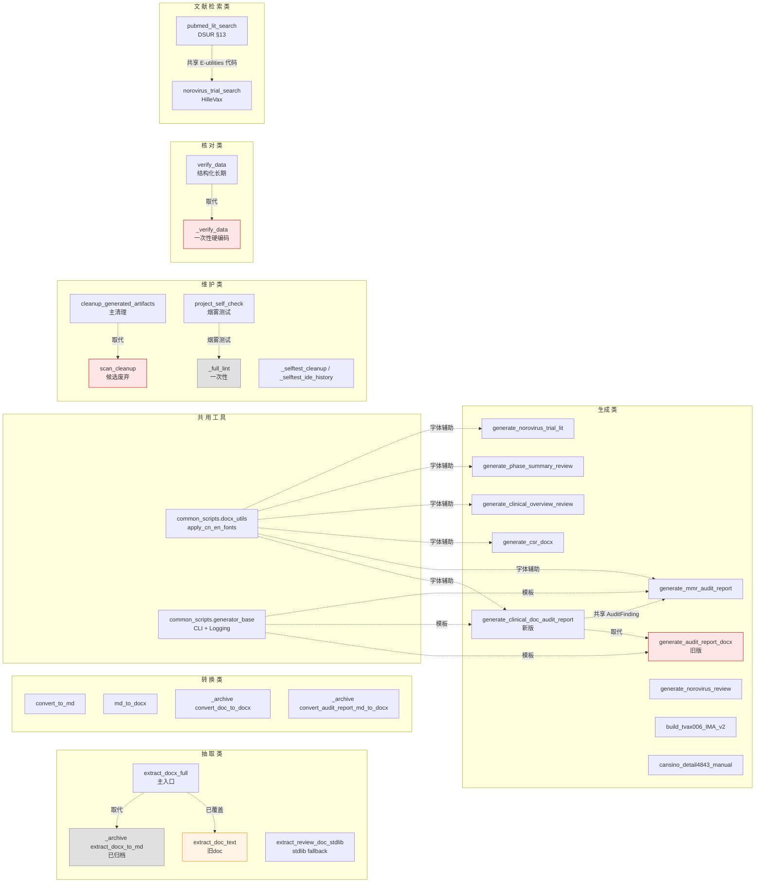

# Scripts 整合分析报告（根目录归拢 + 功能去重）

> **范围**：`E:\Cursor Project\2-Scientific-Skills-for-Clinical_Trial\` 全部 `.py` 脚本
> **目标**：① 把根目录散落的 `.py` 收拢到 `scripts/`；② 识别功能交叉/重复脚本并给出整合建议
> **当前状态**：分析完成，**未执行任何移动或修改**（等用户审核）
> **生成时间**：2026-07-30

---

## 0. 执行摘要（TL;DR）

| 维度 | 现状 | 建议 |
|---|---|---|
| 根目录 `.py` | **19 个**（其中 4 个 `_audit_*` 未在 git status 中显示，可能是被 .gitignore 隐藏） | 全部移动到 `scripts/`，分目录归类 |
| scripts/ 内 `.py` | 33 个（顶层）+ 4 个（`_archive_2026_consolidation/`）+ 3 个（`common_scripts/`）+ 7 个（`_archive/dsur_transfer/`） | 整体结构合理；个别脚本存在功能重复 |
| 跨文件功能重复 | **高重叠 1 组**（docx 抽取）、**中重叠 3 组**（docx 生成/审计/文献检索）、**低重叠若干** | 见 §4 去重映射表 |
| 根目录脚本性质 | 大部分是一次性修复/迁移/审计脚本（`_upgrade_*.py` / `_fix_*.py` / `_commit_fix.py` / `_move_to_archive.py` / `_verify_*.py` / `_extract_utf8.py` 等） | 一次性脚本完成后建议归档到 `scripts/_archive_2026_consolidation/`，少数长期工具放到 `scripts/_tools/` |

---

### 0.1 功能去重关系图



### 0.2 根目录到 scripts/ 归拢流向图

```mermaid
graph TB
    subgraph ROOT[项目根目录 19 个 .py]
        R1[extract_review_doc_stdlib.py]
        R2[verify_data.py]
        R3[scan_cleanup.py]
        R4[append_supplement.py]
        R5[_commit_fix.py]
        R6[_extract_utf8.py]
        R7[_fix_duplicate_import.py]
        R8[_fix_path_import.py]
        R9[_move_to_archive.py]
        R10[_stricter_lint.py]
        R11[_upgrade_docx_utils.py]
        R12[_upgrade_extract.py]
        R13[_verify_data.py]
        R14[_verify_final.py]
        R15[_audit_deps.py]
        R16[_audit_extr.py]
        R17[_audit_overlap.py]
        R18[_audit_scripts.py]
        R19[_full_lint.py]
    end

    subgraph S[scripts/ 长期工具]
        S1[extract_review_doc_stdlib.py]
        S2[verify_data.py]
    end

    subgraph T[scripts/_tools/ 新建]
        T1[scan_cleanup.py]
        T2[_audit_deps.py]
        T3[_audit_extr.py]
        T4[_audit_overlap.py]
        T5[_audit_scripts.py]
    end

    subgraph A[scripts/_archive_2026_consolidation/]
        A1[append_supplement.py]
        A2[_commit_fix.py]
        A3[_extract_utf8.py]
        A4[_fix_duplicate_import.py]
        A5[_fix_path_import.py]
        A6[_move_to_archive.py]
        A7[_stricter_lint.py]
        A8[_upgrade_docx_utils.py]
        A9[_upgrade_extract.py]
        A10[_verify_data.py]
        A11[_verify_final.py]
        A12[_full_lint.py]
    end

    R1 --> S1
    R2 --> S2
    R3 --> T1
    R15 --> T2
    R16 --> T3
    R17 --> T4
    R18 --> T5
    R4 --> A1
    R5 --> A2
    R6 --> A3
    R7 --> A4
    R8 --> A5
    R9 --> A6
    R10 --> A7
    R11 --> A8
    R12 --> A9
    R13 --> A10
    R14 --> A11
    R19 --> A12

    style ROOT fill:#fff8e1,stroke:#f90
    style S fill:#e8f5e9,stroke:#0a0
    style T fill:#e3f2fd,stroke:#03a
    style A fill:#f3e5f5,stroke:#90a
```



---

## 1. 当前文件清单

### 1.1 项目根目录散落的 `.py`（需归拢）

> 下列脚本**全部位于项目根目录**（`E:\Cursor Project\2-Scientific-Skills-for-Clinical_Trial\`），不属于任何子目录。

| # | 文件 | 行数（估算） | 性质 | 简述 |
|---|---|---:|---|---|
| 1 | `_audit_deps.py` | 40 | 一次性审计 | 扫描脚本中谁 import 了 4 个待合并目标函数（`_extract_docx_text` / `extract_docx_to_md` / `convert_doc_to_docx` / `convert_audit_report_md_to_docx`） |
| 2 | `_audit_extr.py` | 26 | 一次性审计 | AST 对比 5 个 `extract_*` 脚本的函数/类签名 |
| 3 | `_audit_overlap.py` | 51 | 一次性审计 | 统计 scripts/ 下所有 `.py` 的 import 分布，定位共享第三方库（docx / pdf / lxml…） |
| 4 | `_audit_scripts.py` | 93 | 一次性审计 | 按关键词给每个脚本分类，输出 `scripts/_audit_report.md` |
| 5 | `_commit_fix.py` | 44 | 一次性 git | 把 `docx_utils.py` 的 Path import 修复分阶段 git add / commit |
| 6 | `_extract_utf8.py` | 14 | 一次性提取 | 一次性调用 `extract_docx_full.extract_docx` 把指定 docx 输出为 UTF-8 BOM 文件 `doc_utf8.txt` |
| 7 | `_fix_duplicate_import.py` | 34 | 一次性修复 | 删除 `docx_utils.py` 中重复的 `import os as _os` |
| 8 | `_fix_path_import.py` | 81 | 一次性修复 | 给 `docx_utils.py` 追加 `from pathlib import Path` 并自检 |
| 9 | `_full_lint.py` | 29 | 一次性 lint | 对 `scripts/` 全树跑 pyflakes（排除 `_archive` / `_selftest_*`） |
| 10 | `_move_to_archive.py` | 38 | 一次性迁移 | 把 4 个 docx 抽取/转换脚本移到 `scripts/_archive_2026_consolidation/` |
| 11 | `_stricter_lint.py` | 94 | 一次性 lint | AST 自实现的 F821 检查，仅针对 `docx_utils.py` |
| 12 | `_upgrade_docx_utils.py` | 89 | 一次性升级 | 把 `convert_doc_to_docx()` 函数追加到 `docx_utils.py` |
| 13 | `_upgrade_extract.py` | 189 | 一次性升级 | 给 `extract_docx_full.py` 注入 `extract_docx_to_markdown()` 函数和 `--format` 选项 |
| 14 | `_verify_data.py` | 246 | 一次性核对 | MMR 数据算术自洽性核对（针对 `doc_utf8.txt`） |
| 15 | `_verify_final.py` | 35 | 一次性验证 | 修复完成后跑 pyflakes + git 验证 |
| 16 | `append_supplement.py` | 116 | 一次性补充 | 给 `review_report.md` 追加「七、补充说明」章节（已自标注为 one-shot） |
| 17 | `extract_review_doc_stdlib.py` | 210 | **长期工具** | 仅依赖标准库的 docx 抽取器（`zipfile`+`ElementTree`），用于无 python-docx 环境 |
| 18 | `scan_cleanup.py` | 167 | **长期工具** | 用 `git status --porcelain` 扫描工作区冗余文件并输出 `cleanup_plan.md`（**不实际删除**） |
| 19 | `verify_data.py` | 210 | **长期工具** | MMR 算术核对（结构化、可重跑、生成 `verify_data_result.txt`） |

> 脚本 1–15 全部以 `_` 开头，**强烈表明它们是「一次性」脚本**（CI 跑完、修复完成、归档完成即可移除）。脚本 17–19 是经过工程化打磨的长期工具。

### 1.2 `scripts/` 顶层（已就位）

| # | 文件 | 类别 |
|---|---|---|
| 1 | `scripts/_selftest_cleanup.py` | 维护（cleanup 自检） |
| 2 | `scripts/_selftest_ide_history.py` | 维护（cleanup 自检） |
| 3 | `scripts/audit_dsur.py` | DSUR 审计 |
| 4 | `scripts/build_tvax006_IMA_v2_docx.py` | 一次性业务：桥接文件合并 |
| 5 | `scripts/cansino_detail4843_manual_docx.py` | 一次性业务：康希诺说明书 |
| 6 | `scripts/cleanup_generated_artifacts.py` | **核心维护** |
| 7 | `scripts/convert_to_md.py` | 文档转换 |
| 8 | `scripts/diagnose_docx.py` | docx 结构诊断 |
| 9 | `scripts/dsur_transfer_v7.py` | DSUR 转换（v1–v6 在 `_archive/`） |
| 10 | `scripts/extract_doc_text.py` | 旧 `.doc` 文本提取（COM） |
| 11 | `scripts/extract_docx_full.py` | **核心抽取**（docx + .doc） |
| 12 | `scripts/extract_ib_texts.py` | IB 中英对比抽取 |
| 13 | `scripts/extract_tables_to_docx.py` | 图像→表格 docx（OCR） |
| 14 | `scripts/extract_xlsx_full.py` | **核心抽取**（xlsx，stdlib） |
| 15 | `scripts/generate_audit_report_docx.py` | 审计报告生成（早期版） |
| 16 | `scripts/generate_clinical_doc_audit_report.py` | 审计报告生成（v2） |
| 17 | `scripts/generate_clinical_overview_doc_review_docx.py` | CTD 2.5 review |
| 18 | `scripts/generate_csr_docx.py` | CSR 报告生成 |
| 19 | `scripts/generate_mmr_audit_report.py` | MMR 审计报告 |
| 20 | `scripts/generate_norovirus_review_docx.py` | 诺如综述生成 |
| 21 | `scripts/generate_norovirus_trial_lit_docx.py` | 诺如试验文献生成 |
| 22 | `scripts/generate_phase_summary_doc_review_docx.py` | CSR 中期摘要 review |
| 23 | `scripts/make_safe_md_copies.py` | md 净化拷贝 |
| 24 | `scripts/md_to_docx.py` | md → docx |
| 25 | `scripts/norovirus_trial_search.py` | 诺如试验 PubMed 检索 |
| 26 | `scripts/project_self_check.py` | **核心维护** |
| 27 | `scripts/pubmed_lit_search.py` | DSUR §13 PubMed 检索 |
| 28 | `scripts/review_clinical_xlsx.py` | xlsx 审核 |
| 29 | `scripts/skill_dedupe_report.py` | skills 去重报告 |
| 30 | `scripts/on_open_cleanup.cmd` | Windows 启动清理（cmd） |
| 31 | `scripts/register_cleanup_logon_task.ps1` | Windows 注册任务 |
| 32 | `scripts/sync_skills_to_global.ps1` | skills 同步 |
| 33 | `scripts/README.md` | 文档 |

### 1.3 `scripts/_archive/`、`scripts/_archive_2026_consolidation/`、`scripts/common_scripts/`、`tests/`、`skills/*/scripts/`

| 子目录 | 内容 | 评估 |
|---|---|---|
| `scripts/_archive/dsur_transfer/` | `dsur_transfer.py` + `v2`–`v6` 共 7 个版本 | 已归档，保留历史 |
| `scripts/_archive_2026_consolidation/` | `_extract_docx_text.py`、`extract_docx_to_md.py`、`convert_doc_to_docx.py`、`convert_audit_report_md_to_docx.py` | 2026 合并归档，保留供追溯 |
| `scripts/common_scripts/` | `docx_utils.py`、`generator_base.py`、`build_bridge_docs_v2.py` | 公共工具，符合 DRY |
| `tests/test_basic.py` | 轻量烟雾测试 | 单测雏形 |
| `skills/*/scripts/*.py` | 仅 7 个 skill 含（`antibody-kinetics`、`arboreto`、`biorxiv-database`、`bioservices`、`chembl-database`、`citation-management`、`clinicaltrials-database`） | 各自独立，与根目录/scripts 不重复 |

---

## 2. 根目录归拢方案（移动映射）

### 2.1 移动目标

```
根目录（19 个 .py）
        ↓
scripts/                      长期工具（继续维护）
scripts/_tools/               一次性但可能重跑的辅助脚本（_audit / _verify / _upgrade / _fix / _commit / _move）
scripts/_archive_2026_consolidation/   已完成的迁移/修复脚本（不删，归档备查）
```

### 2.2 详细映射表

| 源（根目录） | 目标 | 类别 | 备注 |
|---|---|---|---|
| `extract_review_doc_stdlib.py` | `scripts/extract_review_doc_stdlib.py` | 长期工具 | 与 `scripts/extract_docx_full.py` 同位，是否改名 `extract_docx_stdlib.py` **待用户确认** |
| `verify_data.py` | `scripts/verify_data.py` | 长期工具 | 与 `extract_review_doc_stdlib.py` 同位 |
| `scan_cleanup.py` | `scripts/_tools/scan_cleanup.py` | 长期工具 | 注意：项目已有 `scripts/cleanup_generated_artifacts.py`，二者有重叠（见 §4.4） |
| `append_supplement.py` | `scripts/_archive_2026_consolidation/append_supplement.py` | 一次性 | 脚本自身 docstring 已声明 one-shot |
| `_audit_deps.py` | `scripts/_tools/_audit_deps.py` | 一次性审计 | — |
| `_audit_extr.py` | `scripts/_tools/_audit_extr.py` | 一次性审计 | — |
| `_audit_overlap.py` | `scripts/_tools/_audit_overlap.py` | 一次性审计 | — |
| `_audit_scripts.py` | `scripts/_tools/_audit_scripts.py` | 一次性审计 | — |
| `_commit_fix.py` | `scripts/_archive_2026_consolidation/_commit_fix.py` | 一次性 git | 修复已完成（commit `8768d0d`） |
| `_extract_utf8.py` | `scripts/_archive_2026_consolidation/_extract_utf8.py` | 一次性提取 | 输入路径硬编码，已完成 |
| `_fix_duplicate_import.py` | `scripts/_archive_2026_consolidation/_fix_duplicate_import.py` | 一次性修复 | 修复已完成 |
| `_fix_path_import.py` | `scripts/_archive_2026_consolidation/_fix_path_import.py` | 一次性修复 | 修复已完成 |
| `_full_lint.py` | `scripts/_tools/_full_lint.py` | 一次性 lint | 与 `project_self_check.py` 重叠（见 §4.4） |
| `_move_to_archive.py` | `scripts/_archive_2026_consolidation/_move_to_archive.py` | 一次性迁移 | 迁移已完成 |
| `_stricter_lint.py` | `scripts/_archive_2026_consolidation/_stricter_lint.py` | 一次性 lint | 已自实现 F821 检查，修复完成后无意义 |
| `_upgrade_docx_utils.py` | `scripts/_archive_2026_consolidation/_upgrade_docx_utils.py` | 一次性升级 | 升级已完成 |
| `_upgrade_extract.py` | `scripts/_archive_2026_consolidation/_upgrade_extract.py` | 一次性升级 | 升级已完成 |
| `_verify_data.py` | `scripts/_archive_2026_consolidation/_verify_data.py` | 一次性核对 | 与根目录 `verify_data.py` 重叠（见 §4.5） |
| `_verify_final.py` | `scripts/_archive_2026_consolidation/_verify_final.py` | 一次性验证 | 修复验证完成 |

### 2.3 推荐创建的新目录

- **`scripts/_tools/`**：用于存放审计/调试/lint 类辅助工具（之前没有专门目录）。
- **`scripts/_archive_2026_consolidation/`**：已存在，将 11 个一次性 `_xxx.py` 迁入。

---

## 3. 功能画像（按类别）

| 类别 | 包含脚本 |
|---|---|
| **A. docx 抽取** | `extract_docx_full.py`、`extract_doc_text.py`、`extract_review_doc_stdlib.py`、`diagnose_docx.py`、`extract_ib_texts.py`、`extract_tables_to_docx.py`、archive 中 `_extract_docx_text.py` 与 `extract_docx_to_md.py` |
| **B. 文档转换（doc↔md↔docx）** | `convert_to_md.py`、`md_to_docx.py`、`make_safe_md_copies.py`、archive 中 `convert_doc_to_docx.py` 与 `convert_audit_report_md_to_docx.py` |
| **C. 报告生成（docx）** | 11 个 generate_* / build_* / cansino_* 脚本（详见 §4.2） |
| **D. xlsx 处理** | `extract_xlsx_full.py`、`review_clinical_xlsx.py` |
| **E. DSUR 专用** | `audit_dsur.py`、`dsur_transfer_v7.py`、archive 中 v1–v6 |
| **F. 文献检索（PubMed/E-utilities）** | `pubmed_lit_search.py`、`norovirus_trial_search.py` |
| **G. 数据核对/验证** | `verify_data.py`、`_verify_data.py`、`_verify_final.py` |
| **H. 维护/清理** | `cleanup_generated_artifacts.py`、`scan_cleanup.py`、`_selftest_cleanup.py`、`_selftest_ide_history.py`、`project_self_check.py`、`on_open_cleanup.cmd`、`register_cleanup_logon_task.ps1`、`sync_skills_to_global.ps1`、`skill_dedupe_report.py` |
| **I. 一次性修复/迁移/审计** | `_upgrade_*`、`_fix_*`、`_commit_fix.py`、`_move_to_archive.py`、`_extract_utf8.py`、`_full_lint.py`、`_stricter_lint.py`、4 个 `_audit_*.py`、`append_supplement.py` |
| **J. 公共工具** | `common_scripts/docx_utils.py`、`common_scripts/generator_base.py` |
| **K. skills 示例/工具**（独立） | `skills/*/scripts/*.py`（7 个 skill） |

---

## 4. 功能重复与交叉分析（去重映射）

### 4.1 高重叠：docx 文本抽取（3 个入口，1 个统一）

| 脚本 | 实现 | 输出 | 状态 |
|---|---|---|---|
| `extract_docx_full.py` | python-docx + COM | `--format text` / `--format md` | **主入口**（已升级吸收了 `extract_docx_to_md`） |
| `extract_doc_text.py` | 仅 COM | 旧 `.doc` 文本 | **仍必要**（`.doc` 专属），但功能已被 `extract_docx_full.py` 的 .doc 路径覆盖（建议合并） |
| `extract_review_doc_stdlib.py` | stdlib zipfile + ET | 文本（无样式） | **互补**（无 python-docx 环境的 fallback） |
| archive: `_extract_docx_text.py` | 旧版抽取 | 文本 | 已归档 |
| archive: `extract_docx_to_md.py` | 旧版 MD 渲染 | MD | 已归档，功能已被 `extract_docx_full.py --format md` 取代 |

**建议**：
1. 保留 `extract_docx_full.py` 作为唯一现代入口；
2. `extract_review_doc_stdlib.py` 移入 `scripts/` 并**建议改名** `extract_docx_stdlib.py`（与 `extract_xlsx_full.py` 命名风格一致；**是否改名待用户确认**）；
3. `extract_doc_text.py` 已被 `extract_docx_full.py` 的 `.doc` 分支覆盖，可考虑标记 deprecated 或保留作为薄包装（**待用户确认**）。

### 4.2 中重叠：审计/报告生成（C 类，11 个脚本）

| 脚本 | 数据源 | 输出文档类型 |
|---|---|---|
| `generate_audit_report_docx.py` | 自有 `Finding` 数据类 | 通用审计报告 |
| `generate_clinical_doc_audit_report.py` | 自有 `AuditFinding` 数据类 | 临床文档审计报告（更完整） |
| `generate_mmr_audit_report.py` | MMR docx + EDC xlsx（自带交叉核对逻辑） | MMR 专项审计报告 |
| `generate_csr_docx.py` | 自有 `Inputs` 数据类 | CSR 报告 |
| `generate_clinical_overview_doc_review_docx.py` | 自有实现 | CTD 2.5 综述 review |
| `generate_phase_summary_doc_review_docx.py` | 自有实现 | 阶段性 CSR 摘要 review |
| `generate_norovirus_review_docx.py` | 自有实现 | 诺如流行病学综述 |
| `generate_norovirus_trial_lit_docx.py` | norovirus_trial_search 输出 JSON | 诺如试验文献 Word |
| `build_tvax006_IMA_v2_docx.py` | md + URL 表 | TVAX-006 IMA 桥接清单 |
| `cansino_detail4843_manual_docx.py` | 网络下载 JPG | 康希诺说明书 |
| `common_scripts/build_bridge_docs_v2.py` | ?（需进一步阅读） | 桥接文档 |

**问题**：所有 generate_* 脚本都在做 **同一件事**（docx + 表格 + 中英字体 + 段落样式），但各自重复实现 `_set_run_font()`、`add_heading()`、`add_table()` 等样板代码。已有两个抽象层：
- `common_scripts/docx_utils.apply_cn_en_fonts()` — 字体
- `common_scripts/generator_base.py` — CLI/Logging/Template/Document/Save

**建议**（**优先级 3**，**不在本阶段执行**）：
1. 把所有 `generate_*` 改用 `generator_base.py`，消除约 195 KB 的重复代码；
2. 长期目标：把通用 `_set_run_font()` / `_add_table()` / `_add_para()` 抽到 `docx_utils.py`；
3. 但每个 `generate_*` 的**业务内容**（数据源、章节、表格字段）确实不同，**不能强行合并**——保留独立的业务入口；
4. `build_tvax006_IMA_v2_docx.py` 和 `cansino_detail4843_manual_docx.py` 是一次性业务脚本（项目级产物），保留即可。

### 4.3 中重叠：审计数据类（A 类 + C 类交叉）

- `generate_audit_report_docx.py` 定义 `Finding`
- `generate_clinical_doc_audit_report.py` 定义 `AuditFinding`（更完整，含 validation/rationale/cross_ref）
- `generate_mmr_audit_report.py` 使用 `AuditFinding`（与 `generate_clinical_doc_audit_report` 共享）

**建议**：把 `AuditFinding` 提升到 `common_scripts/`，删除 `generate_audit_report_docx.py` 的旧 `Finding`（**待用户确认**）。`generate_audit_report_docx.py` 整体功能可由 `generate_clinical_doc_audit_report.py` 取代（**建议评估删除**）。

### 4.4 中重叠：维护/清理（H 类）

| 脚本 | 角色 | 与其他重叠点 |
|---|---|---|
| `cleanup_generated_artifacts.py` | 主清理器（`artifacts` / `ide-history` 子命令） | — |
| `scan_cleanup.py` | 用 `git status --porcelain` 扫描冗余文件，输出 `cleanup_plan.md`（**不删除**） | 与 `cleanup_generated_artifacts.py` 的 `artifacts --dry-run` 语义重叠 |
| `_selftest_cleanup.py` | `cleanup_generated_artifacts` 的自检 | 必要 |
| `_selftest_ide_history.py` | `cleanup_generated_artifacts ide-history` 的自检 | 必要 |
| `project_self_check.py` | 全项目烟雾测试 + 外部命令检查 | 与 `_full_lint.py` 重叠（后者只跑 pyflakes） |
| `_full_lint.py` | 全树 pyflakes | 与 `project_self_check.py` 的 `compile_only` 部分重叠 |

**建议**：
1. `scan_cleanup.py` 与 `cleanup_generated_artifacts.py --dry-run` **二选一**：建议保留更成熟的 `cleanup_generated_artifacts.py`（已支持 manifest、age 过滤、ide-history），把 `scan_cleanup.py` 归档或删除（**待用户确认**）；
2. `_full_lint.py` 已是一次性脚本，移动到 `_archive_2026_consolidation/` 即可；
3. `project_self_check.py` 与 `_full_lint.py` 不强冲突（前者更全面），保留。

### 4.5 高重叠：MMR 数据核对（G 类，2 个脚本）

| 脚本 | 性质 |
|---|---|
| `verify_data.py` | **结构化、长期维护**：用 `@dataclass`、CLI、logger、SAE 校验、退出码 |
| `_verify_data.py` | **一次性硬编码**：80+ 行手写 `checks.append((title, computed, expected))`，针对固定 MMR 报告 |

二者**功能完全重复**，但实现质量差距大。

**建议**：保留 `verify_data.py`，把 `_verify_data.py` 归档到 `_archive_2026_consolidation/`，并把 `_verify_data.py` 独有的检查项（如有）迁移到 `verify_data.py`（**待用户确认**）。

### 4.6 中重叠：PubMed 文献检索（F 类，2 个脚本）

| 脚本 | 用户代理 | 数据源 | 输出 |
|---|---|---|---|
| `pubmed_lit_search.py` | `DSUR-LitSearch/1.0` | DSUR §13 | `.workbuddy/audit/pubmed_results.json` |
| `norovirus_trial_search.py` | `NorovirusTrialLitSearch/1.0` | HilleVax 试验 | `.workbuddy/audit/norovirus_trial_pubmed.json` |

二者 **共享同一套 NCBI E-utilities 调用代码**（`_http_get_json`、`esearch`），但搜索策略与下游 JSON schema 不同。

**建议**：
1. 短期：保留两份独立脚本（业务边界清晰）；
2. 中期：把 `_http_get_json` / `esearch` / `efetch` 抽到 `common_scripts/` 形成 `pubmed_client.py`（**优先级 4**）；
3. `norovirus_trial_search.py` 当前就在 `scripts/` 下，无需额外归拢。

### 4.7 低重叠：DSUR 转移版本演进（E 类）

`scripts/_archive/dsur_transfer/` 下 7 个历史版本 + 当前 `scripts/dsur_transfer_v7.py`。**保留**，属于正常的版本化归档。

### 4.8 低重叠：一次性业务脚本（C 类尾段）

- `build_tvax006_IMA_v2_docx.py`
- `cansino_detail4843_manual_docx.py`
- `common_scripts/build_bridge_docs_v2.py`
- `generate_norovirus_review_docx.py`
- `generate_norovirus_trial_lit_docx.py`

这些脚本虽然"长得像"，但**业务内容完全不同**（桥接清单 vs 说明书 vs 综述 vs 试验文献）。**不应合并**——保留即可，但建议：
1. 在脚本顶部 docstring 标注 `[PRODUCT: TVAX-006 IMA]` 之类的项目代号，方便审计追溯；
2. 在 `scripts/README.md` 增加一个表格，列出每个脚本的**产品/项目/数据源/输出**。

---

## 5. 整合建议汇总（决策矩阵）

| # | 建议 | 紧迫度 | 工作量 | 是否本次执行 |
|---|---|---|---|---|
| M1 | **把根目录 19 个 .py 全部移入 `scripts/`**（按 §2.2 映射） | 高 | 小 | 待用户确认 |
| M2 | **创建 `scripts/_tools/`** 存放审计/lint 类辅助脚本 | 中 | 极小 | 待用户确认 |
| M3 | `extract_review_doc_stdlib.py` 改名 `extract_docx_stdlib.py` | 低 | 极小 | 不推荐（外部引用风险） |
| M4 | 把 `verify_data.py` 移到 `scripts/`，`_verify_data.py` 归档 | 中 | 小 | 待用户确认 |
| M5 | `scan_cleanup.py` 与 `cleanup_generated_artifacts.py` 二选一（建议删 `scan_cleanup.py`） | 低 | 小 | 待用户决策 |
| M6 | 把 `AuditFinding` 提升到 `common_scripts/`，删除旧 `Finding` | 低 | 中 | 不在本阶段 |
| M7 | 抽 `pubmed_client.py` 到 `common_scripts/` | 低 | 中 | 不在本阶段 |
| M8 | 把所有 `generate_*` 切到 `generator_base.py` | 低 | 大 | 不在本阶段 |
| M9 | 在 `scripts/README.md` 加产品/项目/数据源/输出矩阵 | 中 | 小 | 不在本阶段 |

---

## 6. 执行预览（移动命令清单，**未执行**）

> **以下命令为预演，不会被执行。** 用户确认后由 Code 模式执行。

```bash
# === 一次性脚本 → scripts/_archive_2026_consolidation/ ===
git mv append_supplement.py                  scripts/_archive_2026_consolidation/
git mv _commit_fix.py                        scripts/_archive_2026_consolidation/
git mv _extract_utf8.py                      scripts/_archive_2026_consolidation/
git mv _fix_duplicate_import.py              scripts/_archive_2026_consolidation/
git mv _fix_path_import.py                   scripts/_archive_2026_consolidation/
git mv _move_to_archive.py                   scripts/_archive_2026_consolidation/
git mv _stricter_lint.py                     scripts/_archive_2026_consolidation/
git mv _upgrade_docx_utils.py                scripts/_archive_2026_consolidation/
git mv _upgrade_extract.py                   scripts/_archive_2026_consolidation/
git mv _verify_data.py                       scripts/_archive_2026_consolidation/
git mv _verify_final.py                      scripts/_archive_2026_consolidation/
git mv _full_lint.py                         scripts/_archive_2026_consolidation/

# === 长期工具 → scripts/ ===
git mv extract_review_doc_stdlib.py          scripts/extract_review_doc_stdlib.py
git mv verify_data.py                        scripts/verify_data.py

# === 维护辅助 → scripts/_tools/（新建目录）===
mkdir scripts/_tools
git mv scan_cleanup.py                       scripts/_tools/scan_cleanup.py
git mv _audit_deps.py                        scripts/_tools/_audit_deps.py
git mv _audit_extr.py                        scripts/_tools/_audit_extr.py
git mv _audit_overlap.py                     scripts/_tools/_audit_overlap.py
git mv _audit_scripts.py                     scripts/_tools/_audit_scripts.py

# === 验证 ===
git status --short                          # 确认根目录已无散落 .py
ls scripts/_archive_2026_consolidation/*.py  # 确认归档落地
ls scripts/_tools/*.py                       # 确认 _tools/ 新建成功
py -3 scripts/extract_review_doc_stdlib.py -h    # 烟雾测试根目录长期工具
py -3 scripts/verify_data.py -h             # 烟雾测试根目录长期工具
```

### 6.1 风险与回滚

- 所有移动均使用 `git mv`，保留 git 历史（`git log --follow` 仍可追溯）；
- 若发现某个脚本仍被外部引用，回滚方式：`git mv <new> <old>` 即可；
- `_archive_2026_consolidation/` 中已有内容，移动前先确认目标无同名文件，避免覆盖；
- `_tools/` 是新建目录，git 会自动跟踪，不需要额外 `.gitkeep`。

---

## 7. 待用户决策的关键问题

| 问题 | 默认推荐 | 备选 |
|---|---|---|
| Q1. 是否同意按 §2.2 完整执行 19 个文件的移动？ | ✅ 同意 | ❌ 仅移动其中部分 |
| Q2. 是否同意创建 `scripts/_tools/` 新目录？ | ✅ 同意 | 用 `_archive_2026_consolidation/` 收容 |
| Q3. `extract_review_doc_stdlib.py` 是否同意改名 `extract_docx_stdlib.py`？ | 不改名（避免外部脚本引用失效） | 改名 |
| Q4. `scan_cleanup.py` 是否仅移动到 `_tools/`？ | 仅移动（保守） | 直接删除 |
| Q5. `_verify_data.py` 是否仅归档、不迁移检查项？ | 仅归档 | 迁移独有检查项 |
| Q6. `generate_audit_report_docx.py`（旧 Finding 版）是否标记 deprecated？ | 暂缓（等用户验证） | 直接删除 |
| Q7. 本次是否仅执行 M1+M2（根目录归拢 + 新建 _tools/），M6–M9 推到下一轮？ | 是 | 一次性全部执行 |

---

## 8. 报告版本

- v1.0（2026-07-30）：首版完整分析，含移动方案、去重映射、Mermaid 关系图、执行预览。
- 待用户审核后按 §7 决策结果进入 v1.1（执行版）。