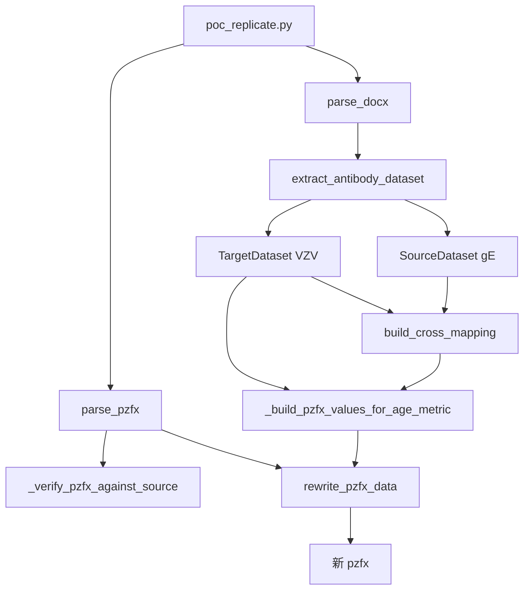

# 08_Word_Tables_to_Graphpad

从 Word（`.docx`）临床小结中抽取"源抗体"与"目标抗体"的免疫原性数据
（GMC / GMI / 阳转率 × 4 年龄段 × 3 时间点 × 2 组别），
按 (年龄段 × 指标) 替换到 GraphPad Prism（`.pzfx`）模板中，生成目标抗体的新 pzfx。

## 适用场景

- 同一份临床试验阶段小结 docx 中同时报告了两类抗体（如 gE 与 VZV）
- 已有以"源抗体"为数据的 pzfx 模板（含 12 张数据表，无图）
- 需要批量把模板改写为"目标抗体"版本，用于不同申报路径

## 运行环境

- **Python 3.10+**
- 依赖：标准库（`zipfile` / `xml.etree` / `dataclasses` / `pathlib` / `re` / `json` / `logging`）
- **不需要** Microsoft Word / pywin32 / pymupdf
- 跨平台：Windows / macOS / Linux

## 快速开始

1) 把 docx 与 pzfx 放入 `input/`

2) 探查结构（生成 md 体检报告）：

```bash
cd 08_Word_Tables_to_Graphpad
python util_probe.py \
  --docx input/source.docx \
  --pzfx input/template.pzfx \
  --out output/_probe_report.md
```

3) 主程序：把 pzfx 中 gE 替换为 VZV

```bash
python poc_replicate.py \
  --docx input/source.docx \
  --pzfx input/template.pzfx \
  --source-antibody gE \
  --target-antibody VZV \
  --out output/result.pzfx \
  --audit-log output/audit.json \
  --verify-report output/verify.json \
  -v
```

## 参数说明

- `--docx`：必填；包含源抗体与目标抗体数据的 docx
- `--pzfx`：必填；以源抗体为数据的 pzfx 模板
- `--out`：必填；新 pzfx 输出路径
- `--source-antibody`：默认 `gE`；源抗体（pzfx 现值对应的抗体）
- `--target-antibody`：默认 `VZV`；目标抗体（替换后的抗体）
- `--audit-log`：可选；审计日志 JSON 路径
- `--verify-report`：可选；校验报告 JSON 路径
- `--table-map`：可选；自定义 (年龄段, 指标) → TableID 的 JSON 映射（覆盖默认）
- `-v` / `--verbose`：详细输出

## 输入输出

- 输入目录：`08_Word_Tables_to_Graphpad/input/`
- 输出目录：`08_Word_Tables_to_Graphpad/output/`

> 注意：仓库根目录的 `.gitignore` 默认不会提交 `input/` / `output/` 下的数据文件，只保留 `README.md` 以保留目录结构。

## 数据约定

### 年龄段
4 档：`40-49岁` / `50-59岁` / `60岁以上` / `50岁以上`

docx 中的写法（`40~49岁` / `40-49岁` 等）会被自动归一化。

### 指标
- `GMC`（抗体几何平均浓度）
- `GMI`（抗体几何平均增长倍数）
- `阳转率` / `SCR`（Seroconversion Rate / 阳转率）

docx 中 `SCR` 会被归一为 `阳转率`。

### 时间点
- `免前`（mFAS 基线）
- `一免后2个月`（≈ 第二剂接种前 / PPS-h1）
- `全免后1个月`（≈ 第二剂接种后 30 天 / PPS-h2）

docx 中无时间点前缀的句子，会回看上一段判定时间点。

### 组别
- `试验组`（ycolumn[0]）
- `阳性对照组1`（40-49岁）
- `阳性对照组2`（50-59岁 / 60岁以上 / 50岁以上）

docx 中"阳性对照组1/2"决定数据写入哪个阳性对照组。

## pzfx 数据格式

pzfx 是 GraphPad Prism 的 XML 格式。本模块支持两种：

| 格式 | 形态 | 检测方法 |
|---|---|---|
| 单文件 XML（Prism 4/5/10 默认） | 整个文件是 XML | 头 4 字节 `<?xm` |
| ZIP 容器（较新版本） | 内含 `DataTables/*.xml` 等 | 头 4 字节 `PK\x03\x04` |

### Subcolumn 排列（关键）

每个 YColumn 内有 3 个 Subcolumn，每个 Subcolumn 含 3 个 `<d>`：

```
Subcolumn[0] = (免前 mid, 一免后2个月 mid, 全免后1个月 mid)   # mid 列
Subcolumn[1] = (免前 up,  一免后2个月 up,  全免后1个月 up)    # up 列
Subcolumn[2] = (免前 lo,  一免后2个月 lo,  全免后1个月 lo)    # lo 列
```

YFormat="upper-lower-limits" 是此约定的标志。

## 默认 (年龄段, 指标) → TableID 映射

适用于"重组带状疱疹疫苗（CHO细胞）II期阶段性小结"模板：

| 年龄段 | GMC | GMI | 阳转率 |
|---|---|---|---|
| 40-49岁 | Table2 | Table5 | Table6 |
| 50-59岁 | Table0 | Table3 | Table7 |
| 60岁以上 | Table1 | Table4 | Table8 |
| 50岁以上 | Table9 | Table11 | Table10 |

如模板不同，通过 `--table-map` 指定自定义映射。

## 架构与数据流



| 模块 | 职责 |
|---|---|
| `lib/docx_parser.py` | docx → DocxContent（段落 + 表格） |
| `lib/pzfx_parser.py` | pzfx → PzfxFile（表 + 亚列） |
| `lib/antibody_mapping.py` | 句式识别 + Triple 解析 + 数据集 |
| `lib/pzfx_writer.py` | 改写 pzfx（不破坏 XML 结构） |
| `poc_replicate.py` | 主程序（CLI） |
| `util_probe.py` | 辅助工具：结构探查 |
| `tests/` | 单元测试 |

## 测试

```bash
cd 08_Word_Tables_to_Graphpad
python -m unittest discover tests/ -v
```

测试覆盖：
- Triple 解析（含 95%CI / 百分数 / 单值）
- 句式识别（含"抗gE"和"gE"两种写法）
- 跨抗体映射
- pzfx 解析（XML 树）
- pzfx 改写（数值替换、None 跳过、结构保留）

## 已知限制

- 假设 pzfx 模板**只有数据表**（无 Graph 节点）。若含 Graph，需扩展 `lib/pzfx_parser.py` 处理图形段
- 假设 docx 句式符合临床小结惯例。**高度个性化**的报告（非常规"试验组和阳性对照组1...分别为..."）需扩展 `extract_antibody_dataset` 的正则
- GMI 免前固定为 1（无变化）；阳转率免前固定为 0（无阳转）。这是 GMI/阳转率的定义

## 变更记录

- 2026-06-26：初版（从 `01_Excel_Charts/output/_*.py` 一次性脚本沉淀）
