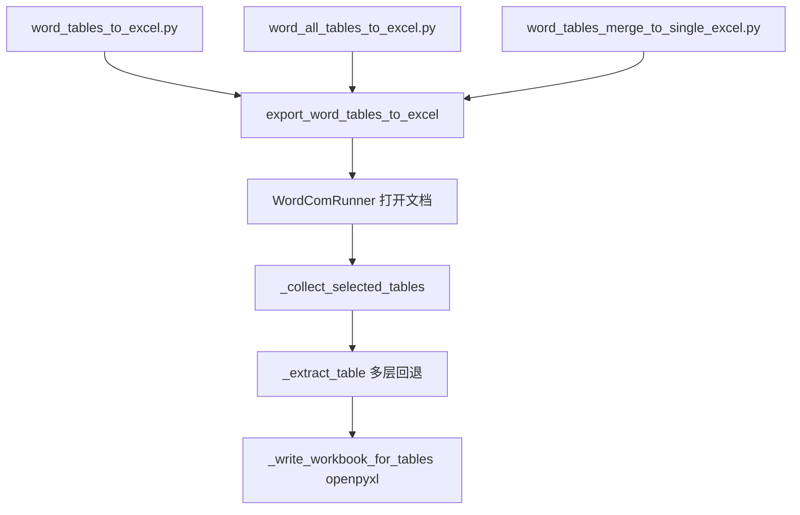

# 09_Word_Tables_to_Excel

把 Word（`.doc/.docx/.rtf`）中的表格导出为 Excel（`.xlsx`），并尽量保证：

- 表头**精准对齐**（支持多行表头合并为"多级表头"）
- 单元格内容清洗（去除 Word 单元格结束符等）
- 输出文件对 Office/国产 WPS 具备良好兼容性（使用 `openpyxl` 生成标准 xlsx）
- **三种使用模式**：
  1. 单文件单表 / 多表导出
  2. 批量：目录下所有 Word 全部顶层表 → 每个 Word 一个多 sheet Excel
  3. 多文件五项指标合并为单一汇总表

## 运行环境

- Windows + 安装 Microsoft Word（使用 `pywin32` 的 COM 自动化读取表格）
- Python 3.8+

## 输入输出

- 输入目录：`09_Word_Tables_to_Excel/input/`
- 输出目录：`09_Word_Tables_to_Excel/output/`

> 注意：仓库根目录的 `.gitignore` 默认不会提交 `input/` / `output/` / `Template/` 下的数据文件，只保留 `README.md` 以保留目录结构。

## 主程序

| 文件 | 角色 |
|------|------|
| `word_tables_to_excel.py` | **主程序**：单文件 → 单 xlsx（指定表序号或关键字） |
| `word_all_tables_to_excel.py` | **主程序**：批量目录下 Word → 多 sheet Excel |
| `word_tables_merge_to_single_excel.py` | **主程序**：多份 Word 合并为单一血清汇总表（Anti-HBc / HBeAg 等五项） |

## 快速开始

### 模式 1：单文件，指定表序号导出
```bash
cd 09_Word_Tables_to_Excel
python word_tables_to_excel.py --input "input/source.docx" --table-indices 1,3
```

### 模式 1.1：单文件，导出单个表
```bash
python word_tables_to_excel.py --input "input/source.docx" --table-index 9
```

### 模式 1.2：单文件，按表头关键字定位
```bash
python word_tables_to_excel.py --input "input/source.docx" --header-keywords "系统器官分类,首选术语"
```

### 模式 2：批量目录下所有 Word
```bash
python word_all_tables_to_excel.py
```

### 模式 3：多份 Word 合并为单一汇总表
```bash
python word_tables_merge_to_single_excel.py
```

## 公共参数

- `--input`：Word 文件路径
- `--output`：输出 xlsx 路径（默认 `output/<word文件名>_tables.xlsx`）
- `--table-indices`：要导出的表格序号（Word 内 `doc.Content.Tables` 的 **1-based** index，例如 `1,3,5`）
- `--table-index`：只导出单个表格序号（1-based），例如 `9`（会覆盖 `--table-indices`）
- `--header-keywords`：用表头关键字自动筛表（逗号分隔）；若同时提供 `--table-indices`，优先按序号
- `--header-rows`：认为"表头占用的行数"（默认 1）。会将多行表头合并为一行列名（`"A / B"`）
- `--merge-tables-from` / `--merge-tables-to`：当 Word 将**视觉上连续的一张表**拆成多个**顶层** `Document.Tables` 时，按序号区间纵向合并（`--merge-tables-to` 缺省为文档最后一个表）
- `--list-word-tables`：启动 Word，列出**顶层表**序号与行列数（与 `--table-index` 使用的序号一致）
- `--list-docx-tables`：不启动 Word，仅解析 `document.xml` 中每个 `<w:tbl>` 的大致行数；**含单元格内嵌套表**，段数往往多于 Word 顶层表数，**不能**直接当作 `--table-index`
- `--quiet`：减少自检信息输出
- `--dry-run`：只抽取并打印行列统计，不写 xlsx（大表自检）

## 模式 2 专属参数（word_all_tables_to_excel.py）

- `--input-dir` / `--output-dir`：输入/输出目录（默认本模块 `input/` `output/`）
- `--skip-existing`：若 output 已存在则跳过该文件
- `--no-backup-existing`：覆盖前不备份旧文件（默认会备份）
- `--overwrite`：直接覆盖输出（不备份）
- `--fail-fast`：遇到错误立即中止
- `--max-files`：最多处理多少个文件（调试用）

## 模式 3 专属参数（word_tables_merge_to_single_excel.py）

- `-o`：合并输出 xlsx 路径（默认 `output/word_tables_merged.xlsx`）
- `--reference-excel <xlsx>`：跨模块对账（与 PDF 侧结果回填）

## 重要说明（序号与"完整性"）

- Word 里 **`Document.Tables` 的个数** = 本工具使用的 `--table-index` 序号。若 `document.xml` 里 `<w:tbl>` 很多，多半是**嵌套表格**被单独计数，与顶层表序号不是同一套编号。
- 若整表 `Range.Text` 过大，历史上可能出现**截断**；当前实现已对大表优先 **按行** `Rows(r).Range.Text` 解析，并带行列数自检（stderr）。

## 参数优先级（与代码一致）

1. `--merge-tables-from`（并可选 `--merge-tables-to`）— 与 `--table-title` / `--table-index` 互斥，启用合并时会忽略表题与序号
2. `--table-title`
3. `--table-indices` 或 `--table-index`
4. 未指定序号时：全量抽取后按 `--header-keywords` 筛选；再无关键字则导出全部顶层表

## 架构与数据流



| 模块 | 职责 |
|---|---|
| `word_tables_to_excel.py` | 单文件导出（核心实现） |
| `word_all_tables_to_excel.py` | 批量：目录下所有 Word → 多 sheet Excel（直接 import 上面那个） |
| `word_tables_merge_to_single_excel.py` | 多份 Word 五项指标合并为单一汇总表 |

## 变更记录

- 2026-06-26：与原 `08_Word_Tables_to_Excel` 合并。08 的核心导出逻辑（`word_tables_to_excel.py`）整合到本模块，原 09 的两个脚本改用直接 `import` 调用，去掉 importlib hack。
