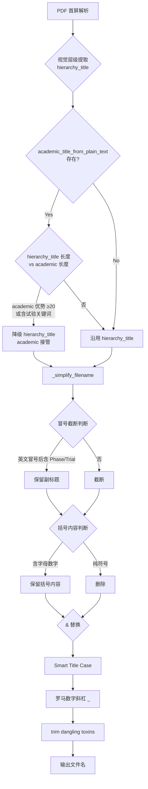

# PDF Sanitizer v7 优化实施计划

## 背景

针对 `Emerging_Microbes_&_Infections_ISSN-2025.pdf`（Taylor & Francis 期刊封面页）出现的重命名错误：

| 问题 | 根因 |
|------|------|
| 期刊名 `Emerging Microbes & Infections` 被误识别为论文标题 | 视觉层级最大字号命中，masthead 黑名单缺失该刊名 |
| 副标题 `Phase I/IIa trial` 因 `:` 被截断丢弃 | `_simplify_filename` 对所有冒号一刀切截断 |
| `(Pichia pastoris)` 被括号过滤器整块删除 | `re.sub(r"[\[\(（【《].*?[\]\)）】》]", "", name)` 无差别删除 |
| `Taylor & Francis` 出版商标识残留 | `_BOILERPLATE_LINE` 缺少 T&F 域名匹配 |
| ISSN 行 `ISSN: 2222-1751 (Online) Journal homepage: www.tandfonline.com/journals/temi20` 未被过滤 | 同上 |

## 实施范围（全部采纳方案 A）

1. **Masthead 黑名单扩展**：T&F / Springer / Wiley / Elsevier 系约 20+ 期刊名
2. **视觉层级 × 学术解析冲突降级**：当 `hierarchy_title` 命中但 `academic` 解析结果更长（≥20 字符优势），优先用学术解析
3. **`&` 和罗马数字容错**：`&` → `And`，保留 `I/IIa` 这类斜杠分隔词
4. **ISSN / T&F 行剥离**：扩展 `_BOILERPLATE_LINE` 正则
5. **括号内容保留策略**：不再整块删除，改为**保留** `(Pichia pastoris)` 等关键技术术语（仅删除纯符号类括号如 `[]`）

---

## 代码改动清单

### 1. `_JOURNAL_MASTHEAD_COMPRESSED` 扩展（行 78–107 附近）

新增以下压缩期刊名（压缩规则：`re.sub(r"[^\w]+", "", s.lower())`）：

```python
# Taylor & Francis 系
"emergingmicrobesinfections",
"tandfonline",
"taylorfrancis",

# Wiley 系（常见医学期刊）
"advancedscience",
"ANGEWANDTE",
"angewandtechemie",
"chemicalcommunication",
"chemistryaeurope",
"eurjic",

# Springer Nature 系（继续扩展）
"cellandmolecularmedicine",
"translationalmedicine",
"scientificreports",

# Elsevier 系（补充）
"heliyon",

# 出版商通用
"journalhomepage",
```

### 2. `_is_journal_masthead_only()` 兜底判定放宽（行 262–275 附近）

```python
# 当前：len(words) <= 4 and len(t) <= 36
# 修改为：
if len(words) <= 5 and len(t) <= 44 and not re.search(r"[.?:;]$", t):
```

### 3. `_BOILERPLATE_LINE` 扩展（行 152–158 附近）

在现有正则后追加：

```python
# Taylor & Francis / Wiley / Springer 出版商行
r"tandfonline\.com|"
r"taylorandfrancis|"
r"wiley\.com|"
r"springer\.com|"
r"springernature|"
r"doi\.org\/10\.|"          # DOI 行
r"issn\s*:?\s*\d{4}-\d{3}[\dX]",  # ISSN 行
```

### 4. `_simplify_filename` 改动（行 562–597 附近）

#### 4.1 冒号截断策略改为"保留副标题"

```python
# 旧：
name = re.split(r"[:：]", name)[0]

# 新：
# 仅在中文冒号或连续多个英文冒号时才截断（允许 Phase I/IIa trial 保留）
# 逻辑：找第一个英文冒号后是否有可读的试验分期词（如 Phase、Randomized、Trial）
parts = re.split(r"[:：]", name, 1)
if len(parts) == 2 and re.search(r"(?i)\b(phase|randomized|trial|study|trial)\b", parts[1]):
    name = name  # 保留副标题
else:
    name = parts[0]
```

#### 4.2 `&` 替换为 `And`

```python
cleaned = re.sub(r"\s*&\s*", " And ", cleaned)
```

#### 4.3 罗马数字斜杠保留（`I/IIa` → `I_IIa`）

```python
# 在末尾 trim 之后、join 之前
# 替换 "I/II" 类模式为 "I_II"
words = [re.sub(r"^([IVXLCDM]+)/([IVXLCDM]+)$", r"\1_\2", w) for w in words]
```

#### 4.4 括号内容：保留技术术语，删除纯符号

```python
# 旧：
cleaned = re.sub(r"[\[\(（【《].*?[\]\)）】》]", "", name)

# 新：
# 保留含字母/数字的技术括号（如 Pichia pastoris、COVID-19）
# 仅删除纯符号括号（如 [10.1016/xxx]、://）
def _smart_bracket_removal(text: str) -> str:
    # 匹配不含字母数字的括号内容
    text = re.sub(r"[\[\(（【《]([^\)\]）】》]*?[a-zA-Z0-9\u4e00-\u9fa5][^\)\]）】》]*)[\]\)）】》]", r"\1", text)
    return text
```

### 5. `hierarchy_title` × `academic` 冲突降级逻辑（`_scan_payload` 行 721–776 附近）

在 `_scan_payload` 中，当 `hierarchy_title` 被设置后，增加二次验证：

```python
# 在 hierarchy_title 赋值后（约 722 行）追加：
# 如果同时有 academic 解析结果，且 academic 显著更优，则降级 hierarchy_title
if hierarchy_title and academic:
    # 比较两者质量：academic 长度优势 ≥ 20 或 academic 含试验关键词
    academic_edge = len(academic) - len(hierarchy_title)
    has_trial_keyword = bool(re.search(
        r"(?i)\b(phase|randomized|trial|study|immunogenicity|safety|efficacy)\b",
        academic
    ))
    if academic_edge >= 20 or (academic_edge >= 8 and has_trial_keyword):
        hierarchy_title = ""  # 降级，让 academic 路径接管
```

### 6. `_simplify_filename` 末尾 trim 逻辑微调（行 588–591 附近）

```python
# DANGLING_TOXINS 范围扩展，新增：
DANGLING_TOXINS.add("old")  # 某些旧 PDF 残留
# trim 允许尾词为 "Or"（临床试验 "A Or B" 设计）
```

---

## Mermaid 流程图：标题解析决策链（v7 改动点标注）



---

## 测试策略

| 测试用例 | 输入 | 预期输出 |
|----------|------|----------|
| T1: T&F 期刊封面 | `Emerging_Microbes_&_Infections_ISSN-2025.pdf` | `Safety_Tolerability_And_Immunogenicity_Of...Phase_I_IIa_Trial-2025` |
| T2: 冒号副标题保留 | 含 `Study: Phase III trial` 的 PDF | 保留完整标题不截断 |
| T3: 技术括号保留 | 标题含 `(Pichia pastoris)` | 保留该括号内容 |
| T4: ISSN 行过滤 | 含 `ISSN: 2222-1751` 行 | 该行不影响标题提取 |
| T5: masthead 黑名单 | 新增的 20 个期刊名 | 不被误判为标题 |

---

## 风险与回退

- **风险 1**：`&` 替换为 `And` 可能导致某些以 `&` 为正式符号的期刊名变长（可接受）
- **风险 2**：冒号截断放宽可能导致极少数含无关冒号的 PDF 标题过长（通过 max_chars=40 硬限制兜底）
- **回退**：改动集中在 `_scan_payload` 和 `_simplify_filename` 两个方法，均为纯函数式逻辑，可独立单元测试
